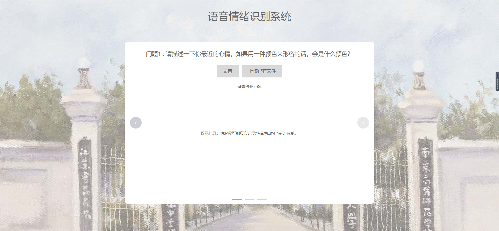
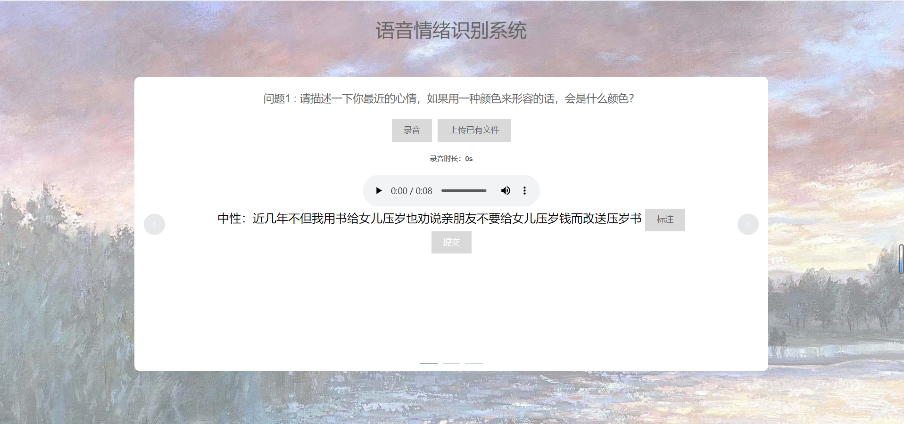

## 前端配置与用户说明

### 相关配置

+ 依赖安装

  ```
  yarn install
  ```

+ 项目运行

  ```
  yarn serve
  ```

### 用户说明

+ 初始页面（提供情绪问答列表）

  

+ ​	

+ 录音文件采集/上传

  

+ 返回模型处理结果

  

  + 提供录音的播放；
  + 语音识别接口返回识别出的文本，将长文本切割为多个短文本，细粒度识别文本情绪；
  + 文本情绪识别模块返回情绪标签并展示；
  + 用户可手动更改文本情绪标注并传回后端数据收集；

+ 
