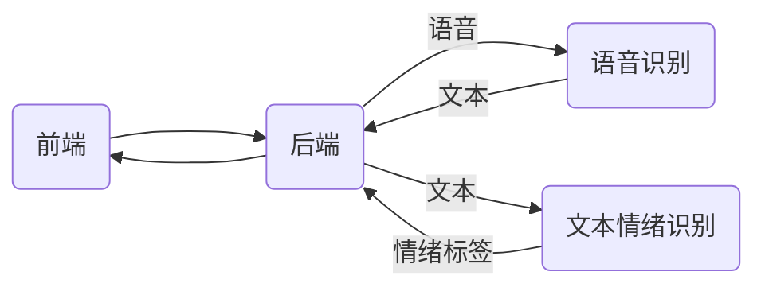

## 项目整体说明

整个项目分为4个部分：前端，后端，语音识别服务，文本情绪识别服务。目前文本情绪识别服务需要运行在服务器上，其他部分均可运行在本地。

+ MER--项目后端

+ preend_1--项目前端一页版

+ preend_2--项目后端两页版，额外新增了语音识别界面

+ PaddlePaddle-DeepSpeech--语音识别服务

  >项目源码：https://github.com/yeyupiaoling/PaddlePaddle-DeepSpeech
  >
  >相关博客：https://blog.csdn.net/qq_33200967/article/details/102904306

+ Textemo--文本情绪识别服务


## 项目环境配置

+ [MER配置](./MER/readme.md)

+ [前端配置](./preend_2/README.md)

+ 语音识别服务配置

  + 安装第三方库

    ```shell
    # 刚需cudatoolkit 10.2版本
    conda install paddlepaddle-gpu==2.3.2 cudatoolkit=10.2 --channel https://mirrors.tuna.tsinghua.edu.cn/anaconda/cloud/Paddle/
    ```

    ```shell
    pip install -r requirements.txt -i https://mirrors.aliyun.com/pypi/simple/
    ```

  + 下载预训练好的模型，详情见[文档](./PaddlePaddle-DeepSpeech/README.md)。将模型解压分别将dataset和models放入PaddlePaddle-DeepSpeech下对应的位置
  + 导出模型

    ```
      python export_model.py --resume_model=./models/param/50.pdparams
    ```


+ 文本情绪识别服务配置

  + 安装第三方库

    ```shell
    conda install paddlepaddle-gpu==2.3.2 cudatoolkit=10.2 --channel https://mirrors.tuna.tsinghua.edu.cn/anaconda/cloud/Paddle/
    ```

    ```shell
    pip install -r requirements.txt -i https://mirrors.aliyun.com/pypi/simple/
    ```


## 项目架构




## 项目调试

1. 在MER文件夹下运行（默认占用端口8000）

   ```shell
   python manage.py runserver
   ```

 2. 在preend_x文件夹下运行（默认占用端口8080）

    ```
    yarn serve
    ```

 3. 在PaddlePaddle-DeepSpeech文件夹下运行（默认占用端口5000）

    ```
    python infer_server.py
    ```

4. 在**服务器**TextEmo文件夹下运行（默认占用端口2233）

   ```
   python text_emo_server.py
   ```

   同时在**本机电脑**上运行命令

   ```
   ssh -CNgv -L 2233:127.0.0.1:2233 xx@ip_address
   ```

   完成上述步骤，可以访问通过本机的127.0.0.1:2233，来调用服务器2233端口的文本情绪分类服务

   

## Tip

模型处理的音频需要满足通道为1，频率在（8000，16000，24000，32000，48000）之中；

在后端`MER`中提供音频规格化接口,原则上前端上传视频需要进行规格化处理后再传入语音识别接口。


## Todo

+ 界面美化
+ 多问题下的情绪识别